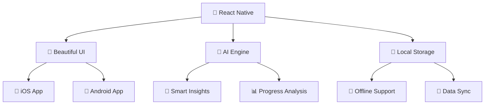

<div align="center">

# 🎯 AI Habit Tracker
### *Transform Your Life, One Habit at a Time* ✨

<p align="center">
  
</p>

<p align="center">
  
  
  
  
</p>

<p align="center">
  
  
  
  
</p>

**[🎬 Demo Video Coming Soon](https://portfolio-website-lilac-xi-72.vercel.app/) • [🌐 Live Portfolio](https://portfolio-website-lilac-xi-72.vercel.app/) • [📧 Contact Developer](mailto:kartik@example.com)**

---

</div>

## 🚀 **What Makes This Special?**

<div align="center">

```
� Smart Habit Building + 🤖 AI Intelligence + 🏆 Gamification = 💪 Life Transformation
```

</div>

### 📱 **Cross-Platform Magic**

<table align="center">
<tr>
<td align="center" width="50%">

**🍎 iOS Native Experience**
```
✨ Smooth iOS animations
🎨 Native design patterns  
⚡ Optimized performance
📱 App Store ready
```

</td>
<td align="center" width="50%">

**🤖 Android Native Experience**
```
🎨 Material Design UI
⚡ Platform optimizations
🔄 Smooth interactions
📱 Play Store ready
```

</td>
</tr>
</table>

---

## ⚡ **Core Features**

<div align="center">

### 🎯 **Smart Habit System**
```
📝 Create → 📊 Track → 🎉 Celebrate → 🔄 Repeat
```

</div>

<table>
<tr>
<td width="33%" align="center">

### 🤖 **AI Intelligence**
```
🧠 Pattern Analysis
💡 Smart Insights  
🎯 Personalized Tips
� Beha*vioral Coaching
```

</td>
<td width="33%" align="center">

### � **Achievemlent System**
```
🎖️ 10 Unique Badges
🔥 Streak Rewards
📊 Progress Rings
🎉 Celebrations
```

</td>
<td width="33%" align="center">

### 📱 **User Experience**
```
🎨 Beautiful Design
⚡ Smooth Animations
📴 Offline Support
♿ Accessibility
```

</td>
</tr>
</table>

---

## 🏗️ **Tech Stack**

<div align="center">



</div>

<div align="center">

**�️ Built yWith Modern Technologies**


</div>

---

## 🎮 **User Experience Flow**

<div align="center">

```
🌅 Wake Up → 📱 Open App → ✅ Complete Habits → 🏆 Earn Badges → 🤖 Get AI Tips → 😴 Sleep Better
```

</div>

### 🏆 **Achievement Unlocks**

<div align="center">

| Badge | Requirement | Reward |
|:---:|:---:|:---:|
| 🎯 **First Steps** | Complete 1st habit | Welcome celebration |
| 🔥 **Week Warrior** | 7-day streak | Fire animation |
| ⭐ **Consistency** | 80% completion | Star shower |
| 👑 **Month Master** | 30-day streak | Crown ceremony |
| 🏆 **Legend** | 100-day streak | Epic celebration |

</div>

---

## �️ **Quick Start**

<div align="center">

### **⚡ Get Running in 60 Seconds**

</div>

```bash
# 🚀 Clone & Install
git clone https://github.com/kartikbhardwaj/ai-habit-tracker.git
cd ai-habit-tracker && npm install

# 📱 Run on Your Device
npx expo start
# Scan QR with Expo Go app

# 🖥️ Or Run in Browser  
npx expo start --web
```

<div align="center">

**📱 Download Expo Go:** [iOS](https://apps.apple.com/app/expo-go/id982107779) • [Android](https://play.google.com/store/apps/details?id=host.exp.exponent)

</div>

---


### � **Architercture Overview**

```
📱 AI Habit Tracker
├── 🎨 4 Beautiful Screens
├── 🧩 8 Reusable Components  
├── 🤖 AI Intelligence Engine
├── 🏆 Achievement System
├── 📊 Progress Analytics
├── 🧪 101 Passing Tests
└── 📱 Cross-Platform Ready
```

---

## 🧪 **Quality Assurance**

<div align="center">

### **🎯 Test Coverage Dashboard**


</div>

```bash
# 🧪 Run All Tests
npm test

# 📊 Generate Coverage Report  
npm run test:coverage

# 🔍 Lint Code Quality
npm run lint
```

---

## 🎬 **Demo & Preview**

<div align="center">

### **📱 App Screenshots**


**🎥 [Demo Video Coming Soon](https://portfolio-website-lilac-xi-72.vercel.app/) - Full app walkthrough**

</div>

---

## 👨‍💻 **Meet the Developer**

<div align="center">


### **🌟 Kartik Bhardwaj**

<p align="center">
  <a href="https://portfolio-website-lilac-xi-72.vercel.app/">
    
  </a>
  <a href="mailto:kartik@example.com">
    
  </a>
  <a href="https://linkedin.com/in/kartikbhardwaj">
    
  </a>
</p>

**🎯 Specializing in React Native • AI Integration • Cross-Platform Development**

</div>

---

## 🚀 **What's Next?**

<div align="center">

### **� Couming Soon**


</div>

---

<div align="center">

---

### **🌟 Love This Project?**

<p align="center">
  
  
  
</p>


**📧 Got Questions? Let's Connect: [kbrupc2020@gmail.com](mailto:kartik@example.com)**

---


</div>
